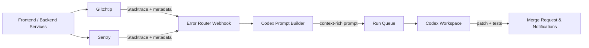

# AstraForge

AstraForge is your on-call DevOps co-pilot, with two clear ways to plug in:
- **Coding-agent sandbox** – start from the browser or API, drop incidents into Codex workspaces, let the agent debug and patch, then launch merge-ready MRs without leaving the UI.
- **Managed DeepAgent backend** – call it via API or the Python package; we host and harden the LangChain DeepAgent sandbox so you get hands-free debugging without carrying the risk surface.

A responsive web app streams live logs, diffs, and chat while the fixes ship.

> Note: AstraForge is under active development; endpoints, workflows, and stack layout may evolve.

## How to connect with deep agent


- [What is AstraForge](#what-is-astraforge)
- [AstraForge Python toolkit](#astraforge-python-toolkit-use-from-another-project)
- [Quickstart (Docker Compose)](#quickstart-docker-compose)
- [Local development (manual)](#local-development-manual)
- [Other workflows](#other-workflows)
- [Configuration](#configuration)
- [Testing and quality](#testing-and-quality)
- [Documentation site](#documentation-site)
- [Contributing](#contributing)
- [Troubleshooting](#troubleshooting)
- [Target error remediation flow](#target-error-remediation-flow)
- [Roadmap](#roadmap)
- [Monorepo layout](#monorepo-layout)
- [Additional resources](#additional-resources)

## What is AstraForge

- **Auto-remediation to merge** – Glitchtip/Sentry alerts forward stack traces, request metadata, and breadcrumbs directly into Codex workspaces so patches, tests, and merge requests are produced without manual triage.
- **Shared, agent-agnostic workspaces** – Human reviewers and any LLM executor can attach to the same streamed workspace, replay runs, and resume conversations regardless of who started the job.
- **Secure sandboxing** – Coding agents run in your isolated Codex workspaces with auto-MR guardrails, while LangChain DeepAgents use the managed sandbox we operate (network guards, ephemeral secrets) for safe debugging.
- **Built for reviewability** – Diff previews, run logs, and chat summaries keep reviewers in the loop before a branch lands in CI.

See `docs/architecture.md` for the current mermaid diagram (kept up to date) and ADRs that capture architectural decisions.

## AstraForge Python toolkit (use from another project)

Install the published package when you want to call DeepAgent or the sandbox API from another app:

```bash
pip install astraforge-toolkit
```

Toolkit contents:
- `DeepAgentClient` – conversations, sandbox sessions, file upload/download, and streaming replies
- `SandboxBackend` – DeepAgents backend that runs inside the remote sandbox
- LangChain tools: `sandbox_shell`, `sandbox_python_repl`, `sandbox_open_url_with_playwright`, `sandbox_view_image`

Create a sandbox session:

```python
from astraforge_toolkit import DeepAgentClient

client = DeepAgentClient(base_url="https://your.astra.forge/api", api_key="your-api-key")
sandbox = client.create_sandbox_session()
client.upload_file(sandbox.session_id, "/workspace/hello.txt", content="hi!\n")
print(client.get_file_content(sandbox.session_id, "/workspace/hello.txt", encoding="utf-8"))
```

Create a sandbox-backed DeepAgent and keep a single sandbox session + thread across calls:

```python
from deepagents import create_deep_agent
from langchain_openai import ChatOpenAI
from astraforge_toolkit import (
    DeepAgentClient,
    SandboxBackend,
    sandbox_shell,
    sandbox_python_repl,
    sandbox_open_url_with_playwright,
    sandbox_view_image,
)

BASE_URL = "https://your.astra.forge/api"
API_KEY = "your-api-key"

client = DeepAgentClient(base_url=BASE_URL, api_key=API_KEY)
sandbox = client.create_sandbox_session()
sandbox_session_id = sandbox.session_id

def backend_factory(rt):
    return SandboxBackend(
        rt,
        base_url=BASE_URL,
        api_key=API_KEY,
        session_id=sandbox_session_id,  # reuse the same sandbox between calls
    )

model = ChatOpenAI(model="gpt-4o")
tools = [sandbox_shell, sandbox_python_repl, sandbox_open_url_with_playwright, sandbox_view_image]

deep_agent = create_deep_agent(model=model, backend=backend_factory, tools=tools)

run_config = {"thread_id": "local-thread", "configurable": {"sandbox_session_id": sandbox_session_id}}
deep_agent.invoke({"messages": [{"role": "user", "content": "List files in /workspace"}]}, config=run_config)
```

Prefer direct HTTP calls? The `DeepAgentClient` streams replies without loading LangChain:

```python
from astraforge_toolkit import DeepAgentClient

client = DeepAgentClient(base_url="https://your.astra.forge/api", api_key="your-api-key")
conv = client.create_conversation()

for chunk in client.stream_message(conv.conversation_id, "Hello, sandbox!"):
    print(chunk)
```

For a ready-to-run smoke test against `http://localhost:8001/api`, open `astraforge-python-package/examples/local_api_test.ipynb`.

## Quickstart (Docker Compose)

Shortest path to the full stack.

1) Prereqs: Docker + Docker Compose, `make`, and an OpenAI-compatible API key.  
2) Create a `.env` in the repo root with your key:

```bash
echo "OPENAI_API_KEY=sk-..." > .env
```

3) Build the required executor images (one time):

```bash
make sandbox-image codex-image
```

4) Start everything:

```bash
docker compose up
```

5) Open `http://localhost:5174` for the app (API at `http://localhost:8001/api`). Stop with `docker compose down`. For details and troubleshooting, see `docs/docker-compose.md`.

## Local development (manual)

1) Install toolchains:

```bash
make install-deps  # creates backend/.venv, installs backend + frontend deps
pip install pre-commit && pre-commit install
```

2) Configure environment (`.env` at repo root) to set `DATABASE_URL`, `REDIS_URL`, `OPENAI_API_KEY`, and related values.  
3) Run migrations:

```bash
source backend/.venv/bin/activate
cd backend
python manage.py migrate
```

4) Start services:

```bash
# Terminal 1 – Django API
make backend-serve

# Terminal 2 – Celery worker queues
cd backend
celery -A astraforge.config.celery_app worker --loglevel=info -Q astraforge.core,astraforge.default --beat
```

5) Launch the LLM proxy:

```bash
cd llm-proxy
uvicorn app.main:app --reload --port 8080
```

6) Build the Codex CLI runner stub (only if you need a local image):

```bash
docker build -t astraforge/codex-cli:latest backend/codex_cli_stub
```

7) Start the frontend:

```bash
cd frontend
pnpm dev
```

Visit `http://localhost:5174` and sign in. Keep `UNSAFE_DISABLE_AUTH=1` limited to local dev.

## Other workflows

- **Compose + Kubernetes hybrid** – Keep API/worker in Docker Compose but run workspaces in Kubernetes with `docker-compose.hybrid.yml`. Export `HYBRID_KUBECONFIG` as described in `docs/kubernetes-local.md`.
- **Local Kubernetes** – Use manifests in `infra/k8s/local` and follow `docs/kubernetes-local.md` (build images, load into Kind/k3d/Minikube, apply manifests, port-forward frontend/backend).

## Frontend webapp


## Configuration

Key environment variables (see `docker-compose.yml` and `docs/docker-compose.md` for full coverage):

| Variable | Purpose / default |
| --- | --- |
| `DATABASE_URL` | Postgres connection (default points to Compose Postgres on 5433) |
| `REDIS_URL` | Redis connection (default `redis://redis:6379/0`) |
| `OPENAI_API_KEY`, `LLM_MODEL` | LLM proxy credentials and model (default `gpt-4o-mini`) |
| `EXECUTOR` | LLM executor name (default `codex`) |
| `PROVISIONER` | Workspace provisioner (`docker` or `k8s`) |
| `RUN_LOG_STREAMER` | Log transport (`redis` by default) |
| `ASTRAFORGE_EXECUTE_COMMANDS` | Allow command execution in workspaces (set to `1` locally) |
| `UNSAFE_DISABLE_AUTH` | Disable auth for local dev only (`1` locally, never in prod) |
| `CODEX_WORKSPACE_IMAGE`, `CODEX_WORKSPACE_NETWORK`, `CODEX_WORKSPACE_PROXY_URL` | Workspace container image, network, and proxy used by Codex |
| `SANDBOX_DOCKER_NETWORK`, `SANDBOX_DOCKER_READ_ONLY`, `SANDBOX_DOCKER_SECCOMP`, `SANDBOX_DOCKER_PIDS_LIMIT`, `SANDBOX_DOCKER_HOST_GATEWAY`, `SANDBOX_DOCKER_USER` | Harden sandbox containers (internal bridge name, read-only rootfs, seccomp profile, PID cap, host gateway toggle, optional run user); defaults target the isolated `astraforge-sandbox` network with egress only to the AI gateway. `SANDBOX_DOCKER_SECCOMP` defaults to `default`; set it to empty, a custom profile path, or `unconfined` to override |
| `SANDBOX_*`, `AWS_*` | MinIO/S3 sandbox storage settings (defaults provided for local) |
| `SECRET_KEY`, `ALLOWED_HOSTS`, `CSRF_TRUSTED_ORIGINS` | Django security settings; replace defaults outside local |

## Testing and quality

- `make lint` – Ruff + ESLint
- `make format` – Ruff formatter + ESLint `--fix`
- `make test` – `pytest` plus `pnpm test -- --run`
- `gitleaks detect --config gitleaks.toml` – secret scanning
- `make generate-openapi` – refresh the OpenAPI schema after API contract changes

## Documentation site

- Location: `docs/site` (Nextra + Next.js, MDX pages under `pages/`).
- Run locally:

```bash
cd docs/site
pnpm install
pnpm dev
```

- Key pages: production deployment, configuration/secrets, sandbox overview, sandbox Python client (`docs/site/pages/sandbox-python-client.mdx`), and operations/testing runbooks.
- Build static output for publishing:

```bash
pnpm build && pnpm export
```

Update `docs/site/pages/_meta.json` when adding new pages. Keep the canonical mermaid architecture diagram current in `docs/architecture.md`.

## Contributing

- Open an issue or PR with a short rationale; reference related ADRs when applicable.
- Before sending a PR, run `make lint`, `make test`, and `gitleaks detect --config gitleaks.toml`.
- Keep docs in sync: update `docs/architecture.md` (mermaid diagram) when behavior changes.
- After backend API changes, regenerate the schema with `make generate-openapi`.

## Troubleshooting

- Postgres not reachable: confirm port `5433` is free and `.env` matches `docker-compose.yml`.
- Docker socket mount errors: ensure Docker is running and your user can access `/var/run/docker.sock`.
- LLM proxy issues: verify `OPENAI_API_KEY` and that the proxy is listening on host port `:8081` (container `:8080`, or `18080` if exposed separately).
- Frontend not loading: check `pnpm dev` is running on `5174` and no conflicting process holds the port.
- MinIO bucket setup: if `minio-setup` fails, ensure `MINIO_ROOT_USER`/`MINIO_ROOT_PASSWORD` match across services.

## Target error remediation flow

Incoming exceptions from the deployed UI/API are captured by Glitchtip or Sentry, normalized, then forwarded into the Codex execution pipeline so fixes ship with the right context (stack trace, request metadata, and workspace snapshot). The workflow below shows the target automated loop:



See `docs/architecture.md` for the accompanying narrative plus operational considerations when wiring the observability stack into automated remediation.

## Roadmap

### Sandbox

- [ ] Switch to SandboxBackendProtocol to have embedded shell tool instead of adding it in tools

### Engine

- [ ] Add claude code
- [ ] Add Mistral dev cli
- [ ] Add Kimi Cli
- [ ] Add Open Coder
- [ ] Add Gemini Coder
- [ ] Add Deep Code
- [ ] Add Kilo Code
- [ ]

### Feature

- [ ] Add Openspec for nl to spec
- [ ] Can choose base default docker image
- [ ] Can batch modify
- [ ] Can generate documentation
- [ ] Can generate architecture mindmap
- [ ] Add context7 mcp (for documentation latest version knowledge)
- [ ] Add playwright mcp to launch and test the App
- [ ] Add SSO connection
- [ ] Add API rate limiting (RPM)
- [ ] Limit number of concurrent sandboxes
- [ ] Add Glitchtip webhook to auto-patch reported bugs

## Monorepo layout

```
.
├── backend/                 # Django REST API, Celery workers, provider registries
│   └── astraforge/
│       ├── domain/          # Domain models + repositories
│       ├── application/     # Use-cases + orchestration pipelines
│       ├── interfaces/      # REST, SSE, registries, inbound adapters
│       └── infrastructure/  # ORM, Redis, external service adapters
├── frontend/                # Vite + React Query + shadcn/ui client
├── llm-proxy/                # FastAPI wrapper that proxies OpenAI (or compatible) APIs
├── sandbox/                  # Sandbox desktop/daemon Dockerfile and assets
├── astraforge-python-package/ # Published `astraforge-toolkit` Python package
├── docs/                     # Architecture overview, ADRs, runbooks
├── infra/                    # Deployment scaffolding (docker, k8s, CI)
└── images/                   # Marketing and README screenshots
```

## Additional resources

- `docs/architecture.md` – canonical mermaid diagram and subsystem explanations.
- `docs/docker-compose.md` – runbook for starting/stopping the stack with Docker Compose.
- `docs/sandbox.md` – sandbox orchestrator API (Docker + Kubernetes) and lifecycle tips.
- `infra/` – Dockerfiles, Helm charts, and CI definitions.
- `opa/` – Rego policies enforced before merges or deployments.
