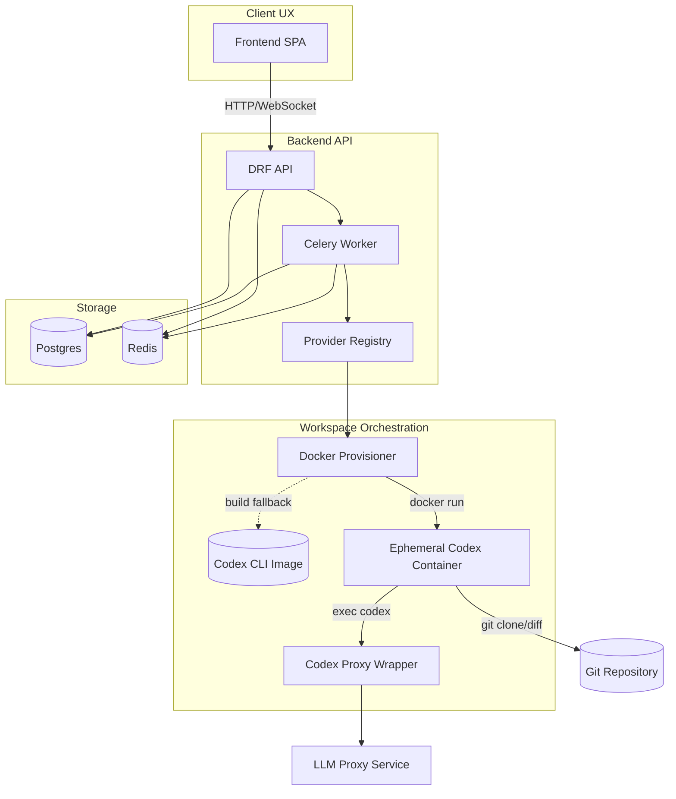

# AstraForge Architecture

- The Django backend exposes REST and SSE endpoints while Celery workers execute longer-running orchestration such as request execution.
- Provider registries resolve executors, provisioners, and workspace operators based on environment configuration.
- Workspace bootstrap favours remote Docker images but transparently builds a local Codex CLI image (`backend/codex_cli_stub`) with the open-source CLI installed via `npm install -g @openai/codex` when the registry image is unavailable, ensuring developers can run the flow offline.
- The local image layers a lightweight proxy stub so the backend can invoke `codex-proxy --listen …`, while the real `codex` binary executes inside the workspace.
- Run log streaming uses server-sent events; the frontend subscribes with `text/event-stream` to receive provisioning and execution updates in real time.
- The request lifecycle state machine supports rerunning execution from the patch-ready state, enabling iterative Codex runs without recreating the entire request.
- Postgres and Redis back the request lifecycle, Celery queues, and event streaming, while the optional LLM proxy hosts model integrations leveraged by future executor implementations.
