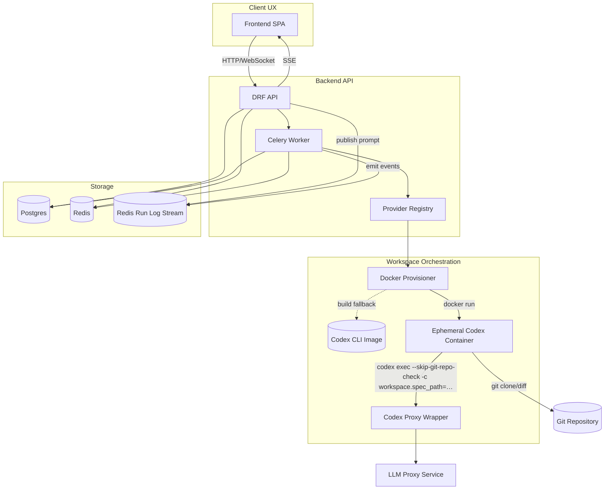

# AstraForge Architecture Overview

AstraForge is an AI-assisted DevOps orchestrator that translates natural language requests into code changes, captures human approvals, and opens merge requests with automated review feedback. Requests now carry the raw user prompt end-to-end: the API stores it with minimal normalization, immediately queues workspace execution, and streams every event back to the client. The platform is organized as a polyglot monorepo with clear boundaries between domain logic, adapters, and infrastructure to support a modular, production-ready deployment.



## Monorepo Layout

```
./ 
├── backend/              # Django + Celery service implementing the API and orchestration pipelines
│   ├── pyproject.toml
│   ├── manage.py
│   └── astraforge/
│       ├── config/       # Django settings (env-based, 12-factor)
│       ├── domain/       # Pure domain models, aggregates, repositories, service ports
│       ├── application/  # Use-cases, command/query handlers, state machine orchestration
│       ├── interfaces/   # DRF viewsets, WebSocket/SSE gateways, provider registries
│       ├── infrastructure/ # Django ORM, Redis, Celery, external service adapters
│       └── tests/
├── frontend/             # React + shadcn/ui single-page app (Vite)
│   ├── package.json
│   ├── src/
│   │   ├── app/          # Route layout (Requests, Conversations, Runs, MR Dashboard)
│   │   ├── components/   # UI primitives, chat composer, diff preview widgets
│   │   ├── features/     # Feature-sliced logic with React Query hooks
│   │   └── lib/          # OpenAPI client, SSE helpers, feature flag registry
│   └── tests/
├── shared/
│   ├── openapi/          # Generated OpenAPI schema + type-safe clients
│   └── packages/         # Reusable libraries (e.g., message contracts, event schemas)
├── infra/
│   ├── docker/           # Container builds for backend, frontend, workers
│   ├── k8s/              # Helm charts, Gatekeeper policies, manifests
│   └── ci/               # GitHub Actions / GitLab CI pipelines
├── docs/                 # Architecture, ADRs, runbooks
└── tools/                # Developer utilities, pre-commit hooks, scripts
```

## Frontend UI System

- `shadcn/ui` is configured via `frontend/components.json` with aliases to `@/components` and `@/lib/utils`, enabling the CLI to scaffold new primitives directly into the Vite workspace.
- Tailwind tokens and animations live in `frontend/tailwind.config.ts`, matching the CSS variables defined in `frontend/src/styles/globals.css`.
- Utility helpers under `frontend/src/lib` expose the canonical `cn` merger so generated components and local features share the same class name helper.

## Core Architectural Principles

- **Hexagonal Architecture**: Domain layer is pure and framework-agnostic. Application layer orchestrates use-cases. Interfaces and infrastructure provide adapters for persistence, messaging, and external services.
- **Prompt-first Execution**: The API accepts raw free-form prompts, derives lightweight metadata, and immediately hands execution to the workspace operator—no intermediate JSON templating or manual spec review step required.
- **Plugin System**: Provider registries allow connectors, executors, VCS integrations, event buses, provisioners, and vector stores to be added without touching core logic.
- **Event-Driven Pipelines**: Redis Streams (or pluggable buses) transport versioned events across request lifecycle stages. Workers subscribe to events and advance the state machine.
- **Isolated Workspaces**: Work execution flows through provisioners that launch Docker or Kubernetes workspaces per request. In local development the Docker provisioner automatically falls back to building a lightweight Codex CLI stub image if a remote registry image is unavailable, ensuring the bootstrap flow succeeds without external dependencies.

## Workspace Orchestration Highlights

- Docker provisioner prefers remote Codex CLI images but will build `backend/codex_cli_stub` (`npm install -g @openai/codex`) to keep local runs self-contained.
- Local Docker Compose deployments run a dedicated `backend-worker` container executing `celery -A astraforge.config.celery_app worker --loglevel=info -Q astraforge.core,astraforge.default`; backend services set `CELERY_TASK_ALWAYS_EAGER=0` so work is handed off to Redis and processed asynchronously.
- Raw prompts are persisted with the request and transformed on-demand into lightweight development specs so the Codex CLI receives meaningful context without a separate planning task.
- Follow-up chat messages (`POST /api/chat/`) append to the request metadata, publish user events, and immediately queue a new execution; the operator restores the Codex history JSONL into both the repository cache and the CLI home directory so multi-run conversations resume seamlessly.
- When the registry image is unavailable, the bootstrapper compiles a local image, tags it `astraforge/codex-cli:latest`, and retries the launch.
- Each workspace boots with `codex-proxy --listen …` to offer a local LLM proxy; the Python wrapper forwards `codex exec` invocations to the real CLI while wiring `~/.codex/config.toml` with an `astraforge-proxy` model provider that points at the proxy and exports the backend-provided API key into the CLI environment. Development environments default to `http://host.docker.internal:8080` while allowing `CODEX_WORKSPACE_PROXY_URL=local` to force the in-container stub.
- Containers run with `--add-host host.docker.internal:host-gateway` so the CLI can reach host-side proxies when required; setting `CODEX_WORKSPACE_PROXY_URL` instructs the workspace operator to bypass the local stub and point Codex at an external proxy endpoint.
- The LLM proxy mirrors OpenAI's `/responses` API (including streaming) so the Codex CLI can reuse the local proxy as a drop-in replacement for remote OpenAI endpoints.
- Diff collection shells into the workspace (`git -C /workspace diff`) and falls back gracefully if the directory is not yet a Git repository.
- Run history events and execution diffs are persisted in request metadata so `/api/runs/` can replay prior console output without rehydrating a workspace. Workspaces emit the exact shell commands they run (clone, branch creation, commit/push, etc.) so the run log mirrors what happens inside the container.

## Key Modules

### Domain
- `Request` aggregate tracks lifecycle from `RECEIVED` through `DONE/FAILED` using a strongly typed state machine.
- Value objects for identifiers, tenant scope, attachments, and artifacts.
- Repository interfaces for persistence (Postgres) and event sourcing (Redis Streams).

### Application
- Use-case services for `SubmitRequest`, `ChatReview`, `GeneratePlan`, `ExecutePlan`, `OpenMergeRequest`, and `ReviewMergeRequest`.
- Orchestrators integrate AgentExecutors with provisioned workspaces and VCS providers.
- Idempotent command handlers leveraging request-scoped message locks and retries.

### Interfaces & Infrastructure
- DRF API with OIDC-authenticated endpoints for requests, chat messages, and administrative features.
- Celery tasks for long-running processing (spec generation, plan execution, MR creation).
- Redis Streams for event propagation with pluggable event bus implementations.
- `RedisRunLogStreamer` persists per-request events so Django's SSE endpoint and Celery workers share the same run log feed, even when they run in separate containers.
- Provider registry resolves connectors, executors, and VCS providers based on environment configuration.
- Observability stack: Prometheus metrics, OTEL traces, structured JSON logs.
- REST interface now exposes `/runs/` and `/merge-requests/` read models that the authoring UI can query for historical console output and diff previews.
- The request run dashboard lists every execution for a request, lets reviewers pick a historical run, and rebuilds the corresponding log stream on demand so multi-run investigations stay organized.

## Data Stores
- **Postgres**: transactional storage for tenants, requests, chat threads, artifacts, and provider configurations (JSONB for flexible payloads).
- **pgvector**: optional similarity search for embeddings, abstracted via `VectorStore` interface.
- **Redis**: message bus (Streams), Celery broker, caching.

## Security & Operations
- 12-factor configuration via environment variables and secrets managers.
- Keycloak OIDC for authentication; API enforces RBAC roles (admin/maintainer/reviewer/observer).
- OPA/Gatekeeper policies ensure workspace diffs comply with path allowlists and size limits.
- Rate limiting, quotas, idempotency keys, and compensating actions for workspace cleanup.

## Extensibility
- Adding a connector requires implementing the `Connector` protocol, packaging it as a Python module, and registering it via entry point configuration or settings.
- New executors implement the `AgentExecutor` interface; runtime selection occurs via DI container using `EXECUTOR` env var.
- VCS providers, provisioners, vector stores, and event buses follow the same pattern.

## Delivery Pipeline
- CI pipelines run linting, typing, tests, and container builds, then package Helm charts.
- Contract tests validate message schemas against provider implementations.
- Review bot posts automated findings on merge requests using configured reviewer identity.

This document will grow alongside ADRs and runbooks to capture detailed decisions as the system evolves.
