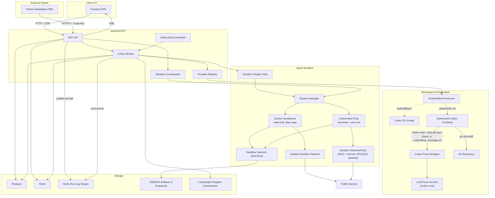
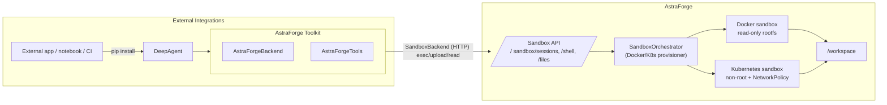
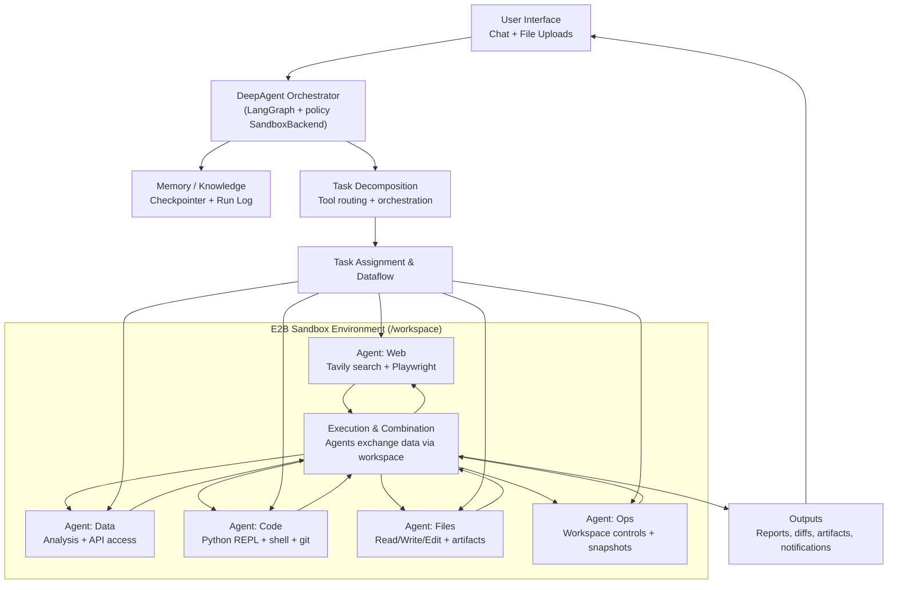
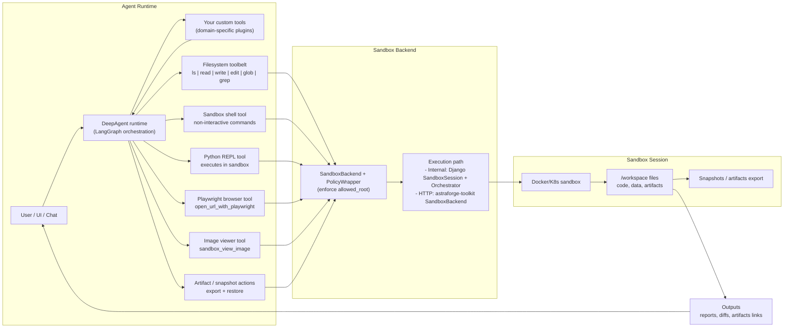
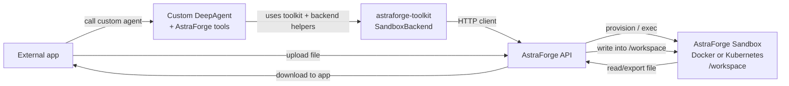
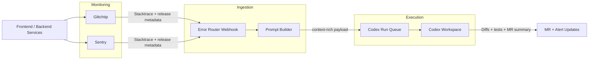

# AstraForge Architecture Overview

AstraForge is an AI-assisted DevOps orchestrator that translates natural language requests into code changes, captures human approvals, and opens merge requests with automated review feedback. Requests now carry the raw user prompt end-to-end: the API stores it with minimal normalization, immediately queues workspace execution, and streams every event back to the client. The platform is organized as a polyglot monorepo with clear boundaries between domain logic, adapters, and infrastructure to support a modular, production-ready deployment.



## Monorepo Layout

```
./ 
├── backend/                 # Django + Celery service implementing the API and orchestration pipelines
│   ├── pyproject.toml
│   ├── manage.py
│   └── astraforge/
│       ├── config/          # Django settings (env-based, 12-factor)
│       ├── domain/          # Pure domain models, aggregates, repositories, service ports
│       ├── application/     # Use-cases, command/query handlers, state machine orchestration
│       ├── interfaces/      # DRF viewsets, WebSocket/SSE gateways, provider registries
│       ├── infrastructure/  # Django ORM, Redis, Celery, external service adapters
│       └── tests/
├── frontend/                # React + shadcn/ui single-page app (Vite)
│   ├── package.json
│   ├── src/
│   │   ├── app/             # Route layout (Requests, Conversations, Runs, MR Dashboard)
│   │   ├── components/      # UI primitives, chat composer, diff preview widgets
│   │   ├── features/        # Feature-sliced logic with React Query hooks
│   │   └── lib/             # OpenAPI client, SSE helpers, feature flag registry
│   └── tests/
├── llm-proxy/                # FastAPI wrapper that proxies OpenAI (or compatible) APIs
├── sandbox/                  # Desktop/daemon Dockerfile for sandboxed sessions
├── astraforge-python-package/ # Published `astraforge-toolkit` Python package
├── infra/
│   ├── ci/                   # GitHub Actions / GitLab CI pipelines
│   └── k8s/                  # Cluster manifests and local kustomize overlays
│       └── local/            # Kind/k3d-ready stack mirroring docker-compose.yml
├── docs/                     # Architecture, ADRs, runbooks
└── images/                   # Marketing and README screenshots
```

The root `Dockerfile` builds the bundled application image that serves the Django
API and built frontend together on port 8001; local engineers can still pick
between `docker-compose.yml` for socket-enabled Docker workspaces and
`infra/k8s/local` for mirrored Kubernetes clusters (documented in
`docs/kubernetes-local.md`). Both paths keep the same environment variables so
switching provisioners (`PROVISIONER=docker` vs `PROVISIONER=k8s`) is frictionless.

## Sandbox Control Plane

- **Sandbox orchestrator API** exposes `/api/sandbox/sessions/` to external agents so they can spin up isolated desktops on Docker (fast local dev) or Kubernetes (hardened multi-tenant) while keeping UUID-backed session identifiers.
- Each session records a `ref` (`docker://…` or `k8s://namespace/pod`), a control endpoint, workspace path, and timeouts for idle (default 5 minutes) and max lifetime (default 1 hour) so cleanup can be enforced without manual intervention.
- Kubernetes sandboxes now stamp the session ID into the pod name and reuse an existing pod on retry instead of spawning a new one, preventing duplicate runtimes for the same session.
- Celery beat triggers a sandbox reaper task that inspects the idle and lifetime thresholds and asks the orchestrator to terminate stale Docker/Kubernetes sandboxes, persisting the `terminated_reason` in session metadata so clients understand why a session stopped.
- Shell commands, file uploads, snapshots, and heartbeats are proxied through the orchestrator, which shells into the container/pod when no in-guest daemon is present; future iterations can swap in a full GUI daemon without changing the public contract.
- Snapshots now write archives into `/tmp/astraforge-snapshots/{session_id}/{snapshot_id}.tar.gz` by default (override with `SANDBOX_SNAPSHOT_DIR`); both manual captures and auto-stop/auto-reap flows pin a `latest_snapshot_id` in session metadata so new sessions can restore via `restore_snapshot_id`. When `SANDBOX_S3_BUCKET` is set, archives are streamed out of the sandbox and uploaded to S3/MinIO (endpoint configurable via `SANDBOX_S3_ENDPOINT_URL`), and restores download from the same bucket before extracting into the workspace. If a user returns to a non-ready sandbox, API calls auto-provision a fresh runtime and apply the `latest_snapshot_id` so the session transparently resumes.
- Artifacts and snapshots are tracked with UUID metadata, and download URLs are derived from `SANDBOX_ARTIFACT_BASE_URL` when available; GUI controls/streaming are stubbed until the sandbox daemon is integrated.
- **Sandbox isolation hardening**: Docker sandboxes now start with `--read-only`, tmpfs mounts for `/workspace`/`/tmp`/`/run`, `--cap-drop=ALL`, `--security-opt=no-new-privileges:true`, `seccomp=default`, and PID limits. They attach to `SANDBOX_DOCKER_NETWORK` (default `astraforge-sandbox`) with the host gateway disabled by default; keep it internal to block LAN or switch to a routed network with host firewall rules if you need internet-only egress. Kubernetes sandboxes run non-root with read-only root filesystems, dropped capabilities, runtime-default seccomp, and service account token auto-mount disabled; the `workspace-networkpolicy.yaml` overlay allows DNS + public internet egress while blocking RFC1918/link-local ranges (so the NAS/LAN stays unreachable), and Codex workspaces layer an additional `codex-egress-llm-proxy` policy so the LLM proxy remains a Codex-only dependency.

### DeepAgent Sandbox SDK

- A lightweight Python client (`astraforge-toolkit` package) wraps the `/api/deepagent/...` and `/api/sandbox/...` endpoints so external applications can create sandbox-backed DeepAgent conversations using only a base API URL and an `X-Api-Key` (`SandboxBackend`, `DeepAgentClient`, and LangChain tools).
- The same client works against local instances (for example `http://localhost:8001/api`) and hosted deployments, providing a single integration surface for experiments, CI jobs, or custom dashboards.

### Python Toolkit + DeepAgent Sandbox Flow



External teams `pip install astraforge-toolkit` inside apps, notebooks, or CI to embed DeepAgent with the packaged `AstraForgeBackend` HTTP client and toolbelt; all filesystem, shell, and Python calls flow through the Sandbox API into Docker or Kubernetes sandboxes mounted at `/workspace`, preserving the same policy-wrapped semantics (allowed root, create-only writes, snapshot-aware reuse) whether the agent runs locally or alongside the hosted service.

### DeepAgent System Architecture & Workflow



### Custom Tools + Filesystem Backend



### Simplified External Integration (DeepAgent + Sandbox)



## Frontend UI System

- `shadcn/ui` is configured via `frontend/components.json` with aliases to `@/components` and `@/lib/utils`, enabling the CLI to scaffold new primitives directly into the Vite workspace.
- Tailwind tokens and animations live in `frontend/tailwind.config.ts`, matching the CSS variables defined in `frontend/src/styles/globals.css`.
- Utility helpers under `frontend/src/lib` expose the canonical `cn` merger so generated components and local features share the same class name helper.

## Core Architectural Principles

- **Hexagonal Architecture**: Domain layer is pure and framework-agnostic. Application layer orchestrates use-cases. Interfaces and infrastructure provide adapters for persistence, messaging, and external services.
- **Prompt-first Execution**: The API accepts raw free-form prompts, derives lightweight metadata, and immediately hands execution to the workspace operator—no intermediate JSON templating or manual spec review step required.
- **Plugin System**: Provider registries allow connectors, executors, VCS integrations, event buses, provisioners, and vector stores to be added without touching core logic.
- **Event-Driven Pipelines**: Redis Streams (or pluggable buses) transport versioned events across request lifecycle stages. Workers subscribe to events and advance the state machine.
- **Isolated Workspaces**: Work execution flows through provisioners that launch Docker or Kubernetes workspaces per request. In local development the Docker provisioner automatically falls back to building a lightweight Codex CLI stub image if a remote registry image is unavailable, ensuring the bootstrap flow succeeds without external dependencies. Codex now writes a `.codex/final_message.txt` summary per run, and the backend ingests that file (or reconstructs the reply from `.codex/history.jsonl` when the file is absent) to append assistant replies to the left-hand chat timeline so users see the last Codex answer immediately after execution completes.

## Workspace Orchestration Highlights

- Docker provisioner prefers remote Codex CLI images but will build `backend/codex_cli_stub` (`npm install -g @openai/codex`) to keep local runs self-contained.
- Local Docker Compose deployments run a dedicated `backend-worker` container executing `celery -A astraforge.config.celery_app worker --loglevel=info -Q astraforge.core,astraforge.default --beat`; backend services set `CELERY_TASK_ALWAYS_EAGER=0` so work is handed off to Redis and processed asynchronously, and Celery beat schedules the sandbox reaper without needing an extra service.
- `SANDBOX_REAP_INTERVAL_SEC` (default `60`) controls how often the beat scheduler asks workers to reap idle or expired sandboxes.
- Local Kubernetes clusters rely on the `infra/k8s/local` kustomize overlay, which mirrors Compose services, runs Django migrations via init containers, and exposes the stack through `kubectl port-forward` so browsers can reach `http://localhost:5174` (frontend) and `http://localhost:8001` (backend) while exercising the Kubernetes provisioner.
- The Kubernetes provisioner talks directly to the cluster using the Python client, spawning short-lived Codex workspace pods per request with `emptyDir` volumes mounted at `/workspaces`, and authenticates through the `astraforge-operator` service account so Celery workers can `create`, `exec`, and `delete` pods without shipping `kubectl` binaries inside the containers.
- A hybrid override (`docker-compose.hybrid.yml`) lets engineers keep the API + Celery services in Docker Compose while pointing them at a local Kind cluster; the override mounts `~/.kube`, rewrites `PROVISIONER=k8s`, and teaches the containers to reach the host's Kubernetes API via `host.docker.internal`.
- The LLM proxy now lives inside workspace orchestration and is a Codex-only dependency; sandboxed DeepAgent flows stay proxy-free while Codex workspaces keep their dedicated gateway.
- Raw prompts are persisted with the request and transformed on-demand into lightweight development specs so the Codex CLI receives meaningful context without a separate planning task.
- Follow-up chat messages (`POST /api/chat/`) append to the request metadata, publish user events, and immediately queue a new execution; the operator restores the Codex history JSONL into both the repository cache and the CLI home directory so multi-run conversations resume seamlessly.
- When the registry image is unavailable, the bootstrapper compiles a local image, tags it `astraforge/codex-cli:latest`, and retries the launch.
- Each workspace boots with `codex-proxy --listen …` to offer a local LLM proxy; the Python wrapper forwards `codex exec -o /workspace/.codex/final_message.txt` invocations to the real CLI while wiring `~/.codex/config.toml` with an `astraforge-proxy` model provider that points at the proxy and exports the backend-provided API key into the CLI environment. Development environments default to `http://host.docker.internal:8080` while allowing `CODEX_WORKSPACE_PROXY_URL=local` to force the in-container stub. If the CLI omits the final-message file, the backend reconstructs the assistant response from the streamed history and still surfaces it in metadata.
- Containers run with `--add-host host.docker.internal:host-gateway` so the CLI can reach host-side proxies when required; setting `CODEX_WORKSPACE_PROXY_URL` instructs the workspace operator to bypass the local stub and point Codex at an external proxy endpoint.
- The LLM proxy mirrors OpenAI's `/responses` API (including streaming) so the Codex CLI can reuse the local proxy as a drop-in replacement for remote OpenAI endpoints.
- Diff collection shells into the workspace (`git -C /workspace diff`) and falls back gracefully if the directory is not yet a Git repository.
- Run history events and execution diffs are persisted in request metadata so `/api/runs/` can replay prior console output without rehydrating a workspace. Workspaces emit the exact shell commands they run (clone, branch creation, commit/push, etc.) so the run log mirrors what happens inside the container, and every captured Codex assistant reply is streamed as an `assistant_message` event so reviewers can read the final output directly from the log feed.

## Key Modules

### Domain
- `Request` aggregate tracks lifecycle from `RECEIVED` through `DONE/FAILED` using a strongly typed state machine.
- Value objects for identifiers, tenant scope, attachments, and artifacts.
- Repository interfaces for persistence (Postgres) and event sourcing (Redis Streams).

### Application
- Use-case services for `SubmitRequest`, `ChatReview`, `GeneratePlan`, `ExecutePlan`, `OpenMergeRequest`, and `ReviewMergeRequest`.
- Orchestrators integrate AgentExecutors with provisioned workspaces and VCS providers.
- Idempotent command handlers leveraging request-scoped message locks and retries.

### Interfaces & Infrastructure
- DRF API with OIDC-authenticated endpoints for requests, chat messages, and administrative features.
- Celery tasks for long-running processing (spec generation, plan execution, MR creation).
- Redis Streams for event propagation with pluggable event bus implementations.
- `RedisRunLogStreamer` persists per-request events so Django's SSE endpoint and Celery workers share the same run log feed, even when they run in separate containers.
- Provider registry resolves connectors, executors, and VCS providers based on environment configuration.
- Observability stack: Prometheus metrics, OTEL traces, structured JSON logs.
- REST interface now exposes `/runs/` and `/merge-requests/` read models that the authoring UI can query for historical console output and diff previews.
- The request run dashboard lists every execution for a request, lets reviewers pick a historical run, and rebuilds the corresponding log stream on demand so multi-run investigations stay organized.

## Automated Incident Remediation Flow

Prod errors triggered in the UI or API surface in Glitchtip or Sentry, and the observability layer
forwards enriched stack traces to the automated Codex remediation pipeline. Each report packages the
stack trace, release metadata, and breadcrumbs so the prompt builder can replay the failing request
inside an isolated workspace and propose a fix without manual triage.



Alert updates posted back to chat/SRE tools keep humans in the loop while Codex executes the patch,
runs regression tests, and assembles a merge request for approval.

## Data Stores
- **Postgres**: transactional storage for tenants, requests, chat threads, artifacts, and provider configurations (JSONB for flexible payloads).
- **pgvector**: optional similarity search for embeddings, abstracted via `VectorStore` interface.
- **Redis**: message bus (Streams), Celery broker, caching.

## Security & Operations
- 12-factor configuration via environment variables and secrets managers.
- Keycloak OIDC for authentication; API enforces RBAC roles (admin/maintainer/reviewer/observer).
- OPA/Gatekeeper policies ensure workspace diffs comply with path allowlists and size limits.
- Sandbox egress is allowlisted: Docker sandboxes default to an isolated bridge (`astraforge-sandbox`) with seccomp+no-new-privileges+PID limits, while Kubernetes sandboxes inherit non-root, read-only security contexts and a NetworkPolicy that permits DNS + public internet while blocking RFC1918/link-local ranges (NAS/LAN). Codex pods add a `codex-egress-llm-proxy` policy when they need the in-cluster LLM proxy; DeepAgent sandboxes stay proxy-free.
- Rate limiting, quotas, idempotency keys, and compensating actions for workspace cleanup.

## Extensibility
- Adding a connector requires implementing the `Connector` protocol, packaging it as a Python module, and registering it via entry point configuration or settings.
- New executors implement the `AgentExecutor` interface; runtime selection occurs via DI container using `EXECUTOR` env var.
- VCS providers, provisioners, vector stores, and event buses follow the same pattern.
- Deep sandbox agents use a composable toolbelt: filesystem helpers (ls/read/write/edit), a Python REPL that executes code inside the sandbox container, a shell helper for short non-interactive commands, Playwright browser navigation, image viewing for screenshots or UI states, and Tavily web search. The backend streams tool calls and `sandbox:workspace/...` file links so the UI can render structured tool cards and one-click downloads.
- A dedicated slide-deck subagent coordinates research, markdown plan generation, and HTML slide rendering inside the sandbox. The main deep agent delegates multi-step “create a slide deck about X” tasks to this subagent so it can gather context with search tools, write a `Plan`+`Slides` markdown document, and emit one self-contained HTML file per slide under `/workspace/slides/...`.

## Delivery Pipeline
- CI pipelines run linting, typing, tests, and container builds, then package Helm charts.
- A bundled `astraforge` image publishes the Django API + Celery base + built Vite frontend (served via Gunicorn/WhiteNoise) so the same artifact can run the web and worker processes.
- Contract tests validate message schemas against provider implementations.
- Review bot posts automated findings on merge requests using configured reviewer identity.

This document will grow alongside ADRs and runbooks to capture detailed decisions as the system evolves.
