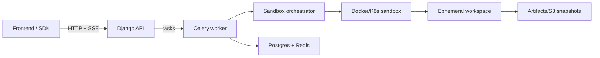

# Architecture

The AstraForge platform orchestrates AI-driven code changes through a Django/Celery backend, a Vite React frontend, and a sandbox control plane that provisions disposable workspaces. Every request flows from the UI or SDK into the backend, triggers workspace execution, and streams events back to the client.

### Core responsibilities

- **Frontend SPA**: streams logs/diffs/chat, drives approvals, and renders sandbox artifacts. Uses the OpenAPI client under `frontend/src/lib`.
- **Backend API + Workers**: DRF endpoints, conversation orchestration, Celery task routing, persistence in Postgres/Redis, and streaming of run/sandbox events.
- **Sandbox orchestrator**: provisions Docker or Kubernetes sandboxes with read-only roots, tmpfs workspaces, dropped capabilities, and network policies. Handles shell, upload, snapshot, and heartbeat APIs.
- **DeepAgent + toolkit**: the LangGraph-based agent and the `astraforge-toolkit` Python package share the sandbox contract so external apps can reuse the same backend.
- **Storage**: Postgres/Redis for core state, S3/MinIO (or local disk) for snapshots/artifacts.

### Additional diagrams

The canonical mermaid diagram lives in `docs/architecture.md` (keep it current). That document also captures sandbox network hardening, the DeepAgent flow, and operational notes for snapshots and artifacts.
